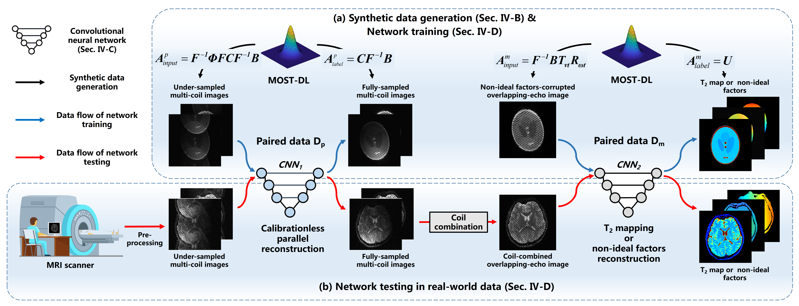

# Model-based Synthetic Data-driven Learning (MOST-DL)

Example codes and data for motion-robust T2 mapping using MOST-DL

**Author**: Qinqin Yang (qqyang@stu.xmu.edu.cn)

**This project relies on [SPROM](https://doi.org/10.6084/m9.figshare.19754836.v2) or [MRiLab](http://mrilab.sourceforge.net/), the full version can be downloaded from zenodo platform**:

    

## Related paper:

MOdel-based SyntheTic Data-driven Learning (MOST-DL): Application in Single-shot T2 Mapping with Severe Head Motion Using Overlapping-echo Acquisition

arXiv: https://arxiv.org/abs/2107.14521

**Table of Conents**

* [Dependencies](#dependencies)
* [CNN1_ParallelRecon](#cnn1parallelrecon)
* [CNN2_T2mapping](#cnn2t2mapping)
* [ParametricTempGen](#parametrictempgen)
* [SyntheticDataGen](#syntheticdatagen)
* [Pipeline](#pipeline)
* [Reference](#reference)

**MOST-DL:**

## Dependencies

The deep learning codes have been tested in [Anaconda 3.6](https://repo.anaconda.com/archive/) with [Pytorch 1.6.0-cuda](https://pytorch.org/get-started/previous-versions/). The training data is in the mat format.

The pre-processing codes have been tested in MATLAB R2019a.

## CNN1_ParallelRecon

The codes in this directory were used to deep learning parallel reconstruction.

`bingo_train.py`: This is the training code, you'd better run it in PyCharm IDE.

`bingo_test.py`: This is the testing code, make sure the trained model has been included in the `./models/` directory.

`network/ResUNet.py`: Network architecture of CNN1.

## CNN2_T2mapping

The codes in this directory were used to deep learning T2 mapping with motion correction.

`bingo_train.py`: This is the training code, you'd better run it in PyCharm IDE. Note that some techniques were applied for accelerating the training (refer to [blog](https://efficientdl.com/faster-deep-learning-in-pytorch-a-guide/)). 

`bingo_test.py`: This is the testing code, make sure the trained model has been included in the `./models/` directory.

`network/UNet.py`: Network architecture of CNN2.

## ParametricTempGen

Example codes for generating MRI parametric templates (T2 and M0) from [IXI database](http://brain-development.org/ixi-dataset/)

`datapro_IXI2map.m`: Convert multi-contrast MRI images to quantitative parametric maps.

`datapro_map2**.m`: Convert parametric maps to templates (virtual object, VObj) for SPROM/MRiLab simulation.

`show_**.m`: Show the VObj files.

## Pipeline

`multicoil_data_MOLED.mat`: A motion-corrupted multi-coil real data for evaluating the pipeline. 

`main.m`: This is a Python-Matlab code to compare the conventional method and MOST-DL, make sure the trained models (see full version) have been included in the `./models/` directory.

## SyntheticDataGen

Example codes for pre-processing the outputs from [SPROM](https://doi.org/10.6084/m9.figshare.19754836.v2) or [MRiLab](http://mrilab.sourceforge.net/), the Bloch-based motion-corrupted data is generated from SPROM. A new version of MRiLab for batch processing is being polished and will be released soon.

`CoilmapGen.m`: Generating coil sensitivity maps from ACS data using ESPIRiT algorithm.

`scan2dataset_**.m`: Processing the outputs of SPROM/MRiLab software for deep learning.

## Reference

**OLED**: C. Cai, C. Wang, Y. Zeng, S. Cai, D. Liang, Y. Wu, Z. Chen, X. Ding, and J. Zhong, “Single-shot T-2 mapping using overlapping-echo detachment planar imaging and a deep convolutional neural network,” Magn. Reson. Med., vol. 80, no. 5, pp. 2202-2214, Nov, 2018. doi: 10.1002/mrm.27205.

**MOLED**: J. Zhang, J. Wu, S. Chen, Z. Zhang, S. Cai, C. Cai, and Z. Chen, “Robust single-shot T2 mapping via multiple overlapping-echo acquisition and deep neural network,” IEEE Trans. Med. Imag., vol. 38, no. 8, pp. 1801-1811, Aug, 2019. doi: 10.1109/tmi.2019.2896085.

**SPROM**: C. Cai, M. Lin, Z. Chen, X. Chen, S. Cai, and J. Zhong, “SPROM - an efficient program for NMR/MRI simulations of inter- and intra-molecular multiple quantum coherences,” C. R. Phys., vol. 9, no. 1, pp. 119-126, Jan, 2008. doi: 10.1016/j.crhy.2007.11.007.

**MRiLab**: F. Liu, J. V. Velikina, W. F. Block, R. Kijowski, and A. A. Samsonov, “Fast realistic MRI simulations based on generalized multi-pool exchange tissue model,” IEEE Trans. Med. Imag., vol. 36, no. 2, pp. 527-537, Feb, 2017. doi: 10.1109/tmi.2016.2620961.

**Please contact us if you have any questions about our work. We hope that synthetic data can help you solve challenging problems in MRI and other fields.**